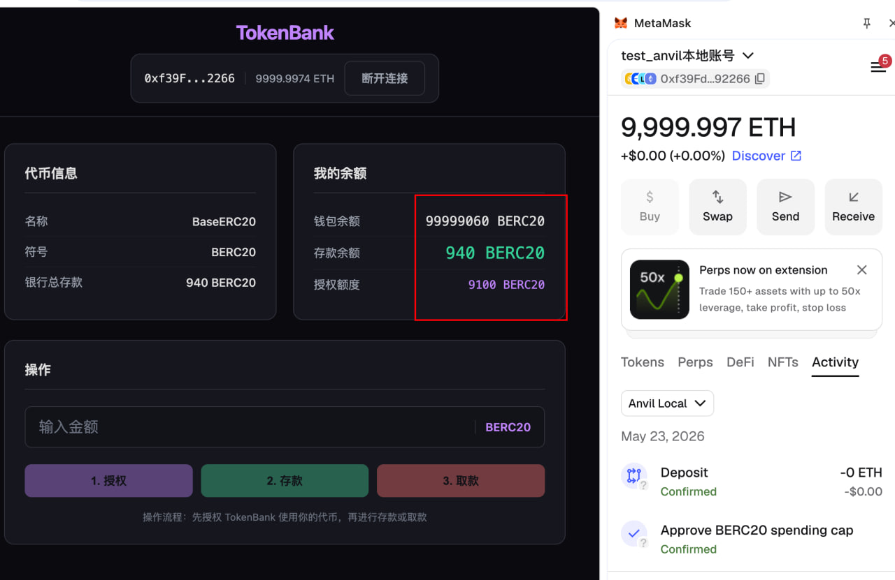

# TokenBank 前端

基于 React + TypeScript + Vite + wagmi 构建的 TokenBank 存款/取款 DApp。

## 截图



## 技术栈

| 技术 | 说明 |
|------|------|
| React 19 | UI 框架 |
| TypeScript | 类型安全 |
| Vite | 构建工具 |
| wagmi v3 | 以太坊 React Hooks |
| viem v2 | 以太坊交互库 |
| SCSS | 深色主题样式 |

## 功能

- **连接钱包** — 支持 MetaMask 浏览器插件
- **代币信息** — 显示代币名称、符号、银行总存款
- **钱包余额** — 实时查询用户 BERC20 代币余额
- **存款余额** — 查询用户在 TokenBank 中的存款
- **授权 (Approve)** — 授权 TokenBank 合约使用代币
- **存款 (Deposit)** — 存入代币到银行
- **取款 (Withdraw)** — 从银行取回存款

## 合约交互流程

```
1. 连接钱包
     ↓
2. 输入金额 → 点击「授权」(approve)
     ↓
3. 授权成功后 → 点击「存款」(deposit)
     ↓
4. 存款到账 → 可点击「取款」(withdraw)
```

## 本地运行

```bash
cd frontend
npm install
npm run dev          # 开发模式，访问 http://localhost:5173
```

## 本地测试环境

```bash
# 终端 1 — 启动本地链
anvil --port 8545

# 终端 2 — 部署合约
forge script script/DeployTokenBank.s.sol:DeployTokenBank \
  --rpc-url http://127.0.0.1:8545 \
  --broadcast \
  --private-key $PRIVATE_KEY
```

MetaMask 配置：
- 添加网络: `http://127.0.0.1:8545`, Chain ID: `31337`
- 导入 Anvil Account #0 私钥（Anvil 启动时日志会打印，或通过 `$PRIVATE_KEY` 环境变量指定）

## 合约地址

| 合约 | 地址 (Anvil 本地) |
|------|-------------------|
| BaseERC20 | `0x5FbDB2315678afecb367f032d93F642f64180aa3` |
| TokenBank | `0xe7f1725E7734CE288F8367e1Bb143E90bb3F0512` |

地址配置在 `src/contracts/addresses.ts`，部署到其他网络后需要更新。

## 项目结构

```
frontend/src/
├── main.tsx                 # 入口，WagmiProvider 配置
├── wagmiConfig.ts           # wagmi 链 + 连接器配置
├── App.tsx                  # 主组件（钱包、余额、操作）
├── App.scss                 # 深色主题样式
├── index.css                # 全局样式重置
└── contracts/
    ├── BaseERC20.ts         # ERC20 ABI
    ├── TokenBank.ts         # TokenBank ABI
    └── addresses.ts         # 合约地址
```

## 构建部署

```bash
npm run build      # 输出到 dist/
npm run preview    # 预览构建结果
```
